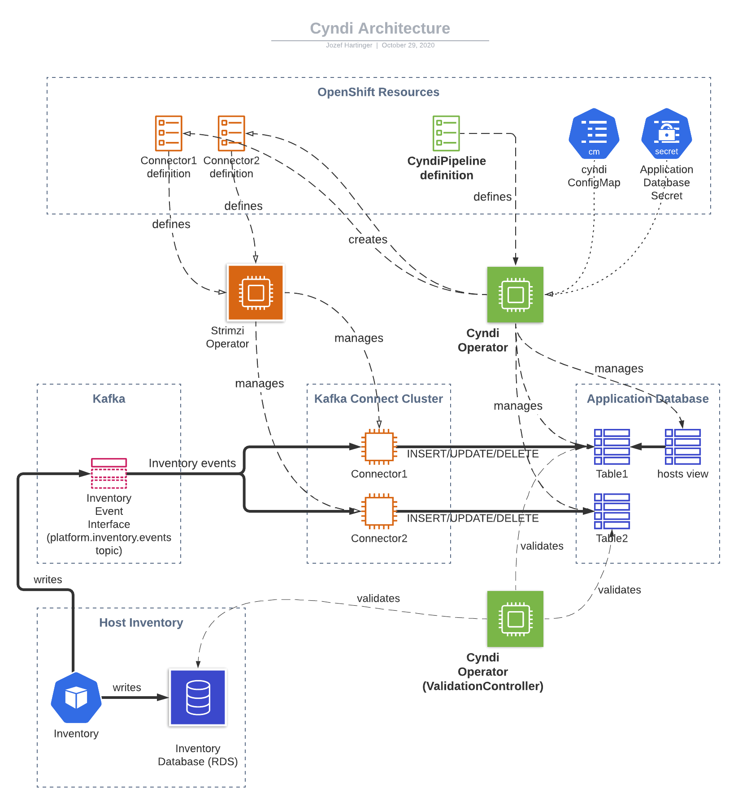

Cyndi Operator
==============

OpenShift operator that manages [Cyndi Pipelines](https://consoledot.pages.redhat.com/docs/dev/services/inventory.html#cyndi), i.e. data syndication between [Host-based Inventory](https://consoledot.pages.redhat.com/docs/dev/services/inventory.html) and application databases.

A syndication pipeline consumes events from the [Inventory Event Interface](https://consoledot.pages.redhat.com/docs/dev/services/inventory.html#_event_interface) and materializes them in the target database.
[Kafka Connect](https://docs.confluent.io/current/connect/index.html) is used for consuming of the events stream.
[Custom transformations](https://github.com/redhatinsights/connect-transforms) are used to process the data.
It is then written into the database using using [JDBC Sink Connector](https://docs.confluent.io/3.1.1/connect/connect-jdbc/docs/sink_connector.html).

For more details about Host Data Syndication (a.k.a. Project Cyndi) see [platform documentation](https://consoledot.pages.redhat.com/docs/dev/services/inventory.html#cyndi)



The operator is responsible for:

* management of database tables and views used to store the data in the target database
* management of connectors in a Kafka Connect cluster (using [Strimzi](https://strimzi.io/))
* periodic validation of the syndicated data
* automated recovery (e.g. when the data becomes out-of sync)

## Design

A Cyndi pipeline is represented by a custom resource of type [CyndiPipeline](https://github.com/RedHatInsights/cyndi-operator/blob/master/config/crd/bases/cyndi.cloud.redhat.com_cyndipipelines.yaml).

Cyndi operator is a cluster-scoped operator that reconciles `CyndiPipeline` resources.

The following diagram depicts the possible states of a Cyndi pipeline:


Typical flow

1. Once a *New* pipeline is created the operator creates a new database table and sets up a Kafka Connect connector that writes data into this table.
1. In the *Initial Sync* phase the connector seeds the database table by reading the inventory events topic.

   The topic is set up with enough retention to contain at least one event for each host.
   It is therefore at any time possible to re-create the target table from scratch.

1. Eventually, the target table becomes fully seeded and the pipeline transitions to *Valid* state.
   In this state the pipeline continues to be periodically validated and may transition to *Invalid* if data becomes out of sync.

1. If

   * the pipeline is *Invalid*, or
   * pipeline configuration changes, or
   * other problem is detected (e.g. database table is missing)

   then the pipeline is refreshed (transitions back to *New*).
   The old table and connector are kept while the new table is being seeded.
   Once the new table becomes *Valid* the `inventory.hosts` view is updated and the old table/connector are removed.

## Configuration

The `CyndiPipeline` custom resource accepts the following attributes:

```yaml
- apiVersion: cyndi.cloud.redhat.com/v1alpha1
  kind: CyndiPipeline
  metadata:
    name: application-pipeline
  spec:
    appName: application-name # name of your application
    insightsOnly: true # whether or not syndicate insights hosts only
    validationThreshold: 5 # TBD
    maxAge: 45 # TBD
    topic: platform.inventory.events # kafka topic to subscribe to for DB events
    dbTableIndexSQL: # plaintext SQL queries defining custom indexes on the syndicated table
    additionalFilters: # additional kafka filters
     - name: reporterFilter # this filter actually does the same thing as `insightsOnly: true`
       type: com.redhat.insights.kafka.connect.transforms.Filter
       if: "!!record.headers().lastWithName('insights_id').value()"
       where: "canonical_facts ? 'insights_id'" # SQL query matching the kafka filter's behavior
```

The `additionalFilter` expects an array of objects (defaults to `[]`) describing custom kafka filters that can be used to restrict the syndication of hosts based on certain parameters. The `name` attribute will be configured as the name of the filter, the `where` attribute configures the SQL query that does the same filtering, but in the databases for validation. Any other attribute except of these two is passed to the filter's definition.

## Requirements

* [Strimzi-managed](https://strimzi.io/docs/operators/latest/quickstart.html) Kafka Connect cluster is running in the OpenShift cluster in the same namespace you intend to create `CyndiPipeline` resources in.
* A PostgreSQL database to be used as the target database
  * [Onboarding process](https://consoledot.pages.redhat.com/docs/dev/services/inventory.html#_onboarding_process) has been completed on the target database
  An OpenShift secret with database credentials is stored in the Kafka Connect namespace and named `{appName}-db`, where `appName` is the name used in pipeline definition. If needed, the name of the secret used can be changed by setting `dbSecret` in the `CyndiPipeline` spec.
* An OpenShift secret named `host-inventory-read-only-db` containing Inventory database credentials (used for validation) is present in the Kafka Connect namespace. The name of the secret used can be changed by setting `inventory.dbSecret` in the cyndi `ConfigMap`, or by setting `inventoryDbSecret` in the `CyndiPipeline` spec.


## Implementation

The operator defines two controllers that reconcile a Cyndi Pipeline
* [PipelineController](./controllers/cyndipipeline_controller.go) which manages connectors, database objects and handles automated recovery
* [ValidationController](./controllers/validation_controller.go) which periodically compares the data in the target database with what is stored in Host-based inventory to determine whether the pipeline is valid

### Reconcile loop

These are high level descriptions of the steps taken within the reconcile loop in each state:

* New

  1. Update the Pipeline's status with the pipeline version (uses the current timestamp)
  1. Create a new table in AppDB (e.g. inventory.hosts_v1_1597073300783716678)
  1. Create a new Kafka Sink Connector pointing to the new table

* Initial sync
  * Attempts to validate that the data is in sync.
    Each time the validation fails, it will requeue the reconcile loop until validation succeeds, or the retry limit is reached.
  * If the retry limit is reached before validation succeeds, the pipeline is refreshed (transitions to *New* state)
  * After validation succeeds, the DB view (inventory.hosts) is updated to point to the new table and the pipeline transitions to *Valid* state.

* Valid
  * ValidationController periodically validates the syndicated data. If data validation fails, the pipeline transitions to *Invalid* state

* Invalid
  * In the *Invalid* state the ValidationController continues with periodic validation of syndicated data.
  * If the validation succeeds, the pipeline transitions back to the *Valid* state.
  * If the pipeline fails to become valid before the retry limit is reached, the pipeline is refreshed (transitions to *New* state)

In addition, regardless of the state, PipelineController:

* checks that configuration of the CyndiPipeline resource or the `cyndi` ConfigMap hasn't changed
* checks that the database table exists
* checks that the connector exists
* removes any stale database tables and connectors

### Validation

ValidationController currently only validates host identifiers.
It validates that all host identifiers stored in the Inventory database are present in the target database and that no other identifiers are stored in the target database.
The controller does not currently validate other fields (tags, system_profile, ...).

A threshold can be configured using the [cyndi ConfigMap](./examples/cyndi.configmap.yml).
The threshold causes the validation to pass as long as the ratio of invalid records is below this threshold (e.g. 1%)

## Development

### New instructions

1. Follow the [development environment instructions for the xjoin-operator](https://github.com/RedHatInsights/xjoin-operator#development).

2. Scale down the cyndi-operator deployment in kubernetes:
    ```bash
    kubectl scale --replicas=0 deployments/cyndi-operator-controller-manager -n cyndi-operator-system   
    ```
   
3. Add the following to `/etc/hosts`
    ```
    127.0.0.1 advisor-backend-db advisor-backend-db.test.svc advisor-db inventory-db
    ```
   
4. Forward ports
    ```
    sudo -E kubefwd svc --kubeconfig ~/.kube/config -m 8080:8090 -m 8081:8091 -n test
    ```

### Running the operator locally

With the cluster set up it is now possible to install manifests and run the operator locally.

1. Install CRDs
    ```
    make install
    ```

1. Run the operator
    ```
    make run ENABLE_WEBHOOKS=false
    ```

### Running the operator using OLM

An alternative to running the operator locally is to install the operator to the cluster using OLM.

1. Install OLM
    ```
    kubectl apply -f https://github.com/operator-framework/operator-lifecycle-manager/releases/download/v0.17.0/crds.yaml
    kubectl apply -f https://github.com/operator-framework/operator-lifecycle-manager/releases/download/v0.17.0/olm.yaml
    ```

1. Install the operator
    ```
    oc process -f ../deploy/operator.yml -p TARGET_NAMESPACE=cyndi -o yaml | oc apply -f -
    ```


### Development

[This is general info on building and running the operator.](https://master.sdk.operatorframework.io/docs/building-operators/golang/quickstart/)

As mentioned in the quickstart, run `make generate` any time a change is made to `cyndipipeline_types.go`.
Similarly, run `make manifests` any time a change is made which needs to regenerate the CRD manifests.
Finally, run `make install` to install/update the CRD in the Kubernetes cluster.

I find it easiest to run the operator locally.
This allows the use of a debugger.
Use `make delve` to start the operator in debug mode.
Then connect to it with a debugger on port 2345.
It can also be run locally with `make run ENABLE_WEBHOOKS=false`.

After everything is running, create a new Custom Resource via `kubectl apply -f config/samples/example-pipeline.yaml`.
Then the CR can be managed via Kubernetes commands like normal.

### Running the tests

1. [Setup the dev environment](#devenv)
2. Forward ports via `dev/forward-ports.sh`
3. Run the tests with `make test`

### Useful commands

- Populate shell environment with credentials to databases:
    ```
    source $HOME/projects/xjoin-operator/dev/get_credentials.sh test
    ```

- Create a host using the [insights-host-inventory Makefile](https://github.com/RedHatInsights/insights-host-inventory/blob/master/Makefile)
    ```
    cd $HOME/projects/insights-host-inventory
    pipenv shell
    make run_inv_mq_service_test_producer
    ```

- List hosts
    ```
    psql -U "$HBI_USER" -h host-inventory-read-only-db -p 5432 -d "$HBI_NAME" -c "SELECT * FROM HOSTS;"
    ```

- Access the kafka connect API at http://connect-connect-api.test.svc:8083/connectors

- Connect to inventory db
    ```
    psql -U "$HBI_USER" -h host-inventory-read-only-db -p 5432 -d "$HBI_NAME"
    ```

- Connect to advisor db
    ```
    psql -U "$ADVISOR_USER" -h advisor-backend-db -p 5432 -d "$ADVISOR_NAME"
    ```

- Inspect index image
    ```
    opm index export --index=quay.io/cloudservices/cyndi-operator-index:local -c podman
    ```
